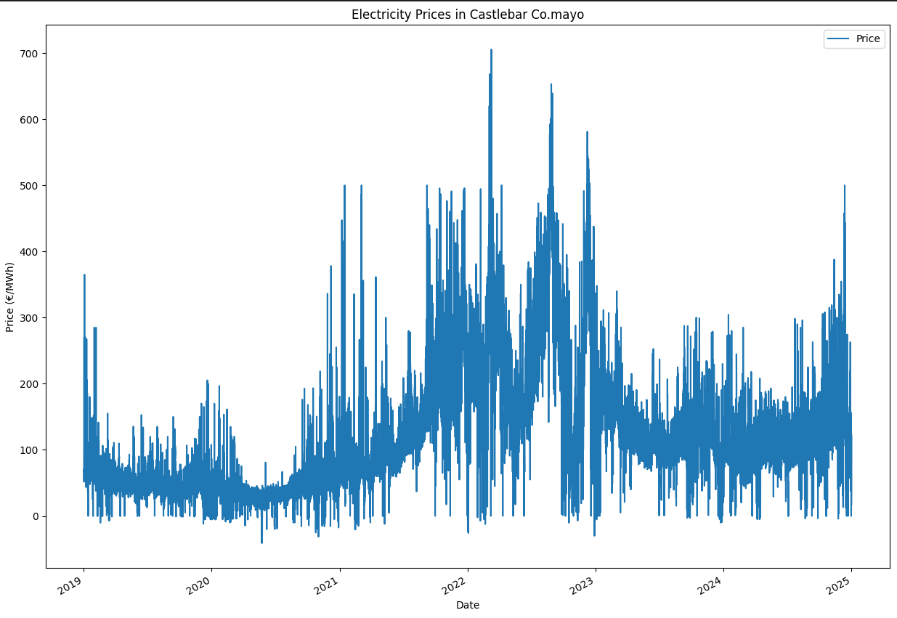
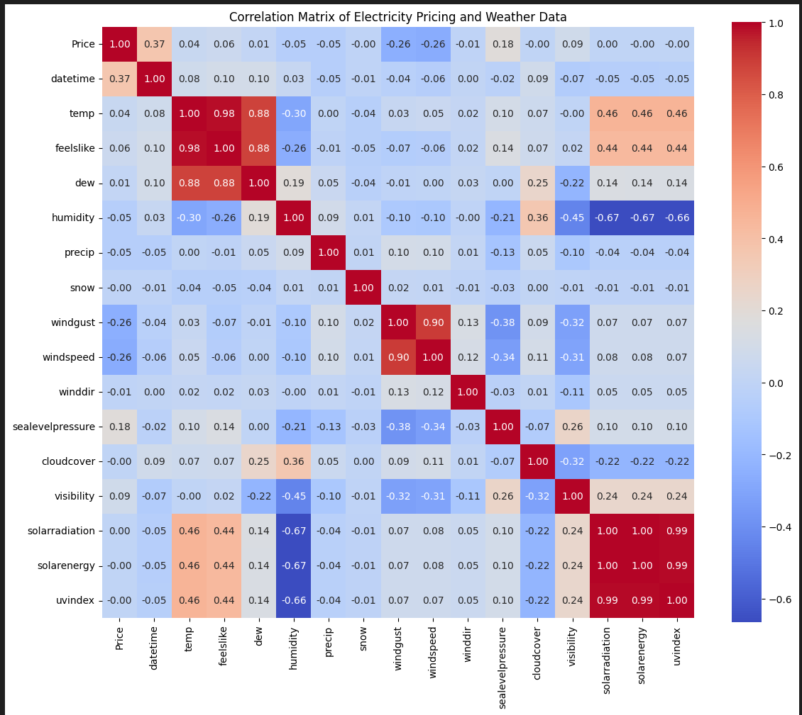

 📈 Visualizing and Interpreting Drivers of Electricity Prices in Ireland (2019–2025)
# What was the aim of my project
- In this project my aim was to understand, visualize and interpret which weather variables have an influece on irish electriciy prices on the ISEM. 
- My background in systematic futures trading lead me to question what varibles move electiricy prices? Similar to what varibles move stocks and certian futures products

## 🥽Visualizations

```python
import pandas as pd
import seaborn as sns
import matplotlib.pyplot as plt
```


```python
ax = df.plot(x='datetime', y='Price', figsize=(15, 11))
ax.set_xlabel("Date")
ax.set_ylabel("Price (€/MWh)")
ax.set_title('Electricity Prices in Castlebar Co.mayo' )

plt.show()
```

 
fIg 1.0: Electricity Prices over time 
- Shows large price volatility beginning in late 2021 and peaking in 2022.
- Price spikes coincide with known global energy market disruptions.
- Recent prices remain elevated compared to 2019–2020 baseline.

```python 
# Plot the correlation matrix
plt.figure(figsize=(15, 11))
sns.heatmap(correlation_matrix, annot=True, fmt=".2f", cmap="coolwarm", square=True)
plt.title("Correlation Matrix of Electricity Pricing and Weather Data")
plt.tight_layout()
plt.show()
```



Fig2.0: Varibles correlating to electricy Prices 
- Compares electricity prices to 17 weather variables including temperature, wind, solar, humidity, cloud cover, and more.
- Helps highlight potential predictive features for modeling.
### 🧰 Tools used
- Python 
- Pandas , matplot lib, Seaborn 
- VS code 
- Visual crossing (Weather and elcetrcicty price data)
### Key insights

##### ⚡Electrciity price volatilty(2019-2025) 
- Price volatility increased significantly **after 2021**, aligning with the **European energy crisis and high fossil fuel prices**.
- Electricity prices were most **stable between 2019–2020** , then surged rapidly, spiking above **€700/MWh** during peak stress periods.
- This suggests Irelands market exposure to **macro fuel supply risks and low renewable output periods**.


#### ☔ Wind Variables Suppress Prices
- `windgust` and `windspeed` show **moderate negative correlation (~ -0.26)** with electricity prices.
- Wind power (zero marginal cost) increases supply, suppressing wholesale prices during high-wind periods.
- Wind is a key driver of **short-term price reductions**, especially in coastal areas like Mayo.


#### 🔹 Pressure as a Lead Indicator
- `sealevelpressure` has a mild negative correlation with price (-0.18).
- Low-pressure systems are associated with higher wind → increased renewable generation → lower prices.
- Suggests pressure may be a **useful leading weather signal** for forecasting price dips.


####  🔨Methodology

- **Weather data** : collected from [visualcrossing.com] and local weather stations
- **Electricity price data**: sourced from [visualcrossing.com]
- **Data merging**: on hourly timestamps and cleaned for consistency.
- **Tools used**: `pandas`, `matplotlib`, `seaborn`, `numpy`, 


#### 😎 Future work

- This project is part of a broader study to understand power market behavior using data science. It serves as both a research tool and a technical showcase for entry into power trading, energy analytics, or data-driven forecasting roles.
- In the future I would like to add moving averages to plot the average electriciy price since 2019 
- Study and incorperate **net imbalance volume** (NIV) 
- Add **european natural gas prices** to see correlations , european gas prices vs american gas prices 
- Add volume weighted average price lines